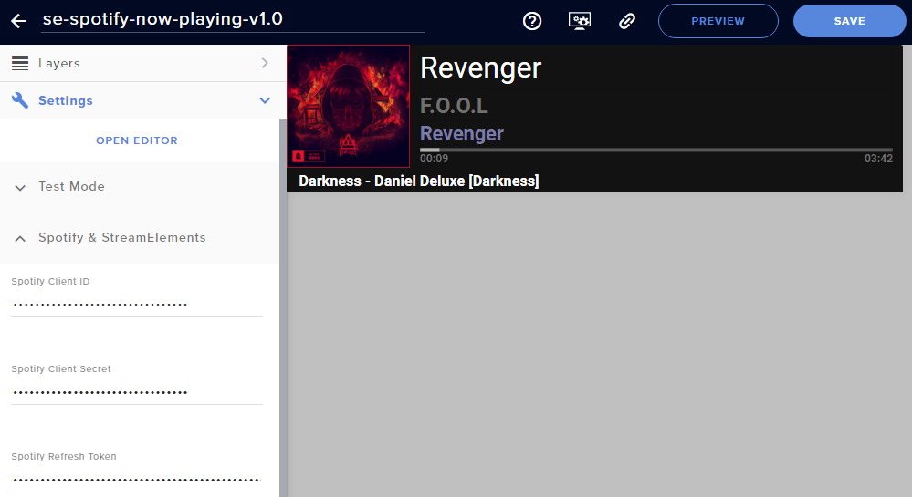
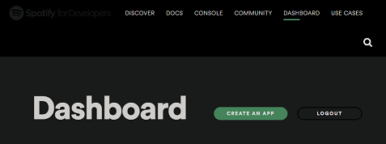
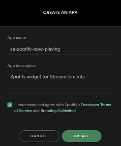
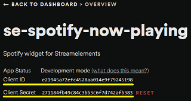
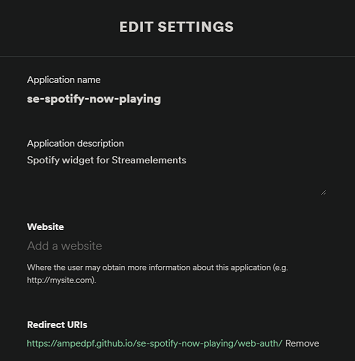
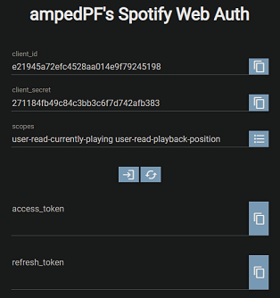
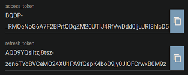

# Spotify-Now-Playing
A StreamElements' custom widget to display currently playing track information.  
  

## Retrieve Spotify & StreamElements information
1. Login and create an app on [Spotify Dashboard](https://developer.spotify.com/dashboard/) to have your `client_id` and `client_secret`.
  
  

2. Once created, click on "Edit Settings" button and set the `Redirect URIs` to
`https://ampedpf.github.io/se-spotify-now-playing/web-auth/` before saving.  
  
  

3. To retrieve an `access_token` and a `refresh_token`, use my custom [Spotify Web Auth](https://ampedpf.github.io/se-spotify-now-playing/web-auth/) page with scopes set at the very least to :  
`user-read-playback-position user-read-recently-played`  
  

4. Login to [StreamElements](https://streamelements.com/dashboard/account/channels) and retrieve your `Account ID` and the `JWT Token` by clicking on the "Show secrets" toggle on the right side.

## Setting up the custom widget
1. Create an overlay from StreamElements' [Dashboard](https://streamelements.com/dashboard/overlays).

2. Add a `STATIC/CUSTOM > Custom widget`.

3. From the Settings panel, click on the `Open Editor` button.

4. Delete the content of the HTML tab.

5. Copy/Paste the content of `index.html` into the HTML tab.

6. Repeat the process for the `main.css` file into the CSS tab.

7. Repeat the process for the `main.js` file into the JS tab.

8. Repeat the process for the `fields.json` file into the FIELDS tab.

9. Click on the "Done" button at the bottom right.

10. Copy the information from the previous part to the `Spotify & StreamElements` panel on the left.

11. Start playing a song on spotify and the widget should appear.

12. Customize the widget using the other panels on the left side.
